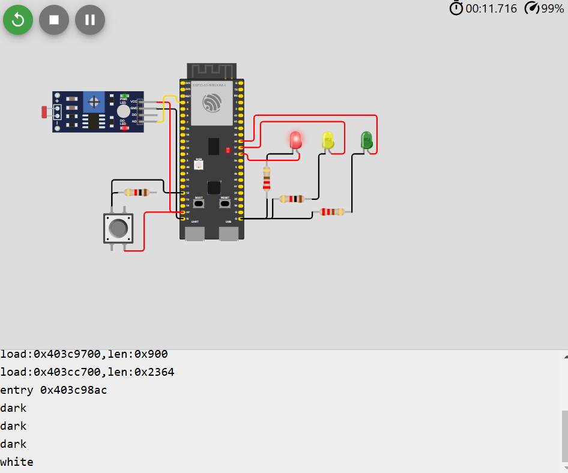
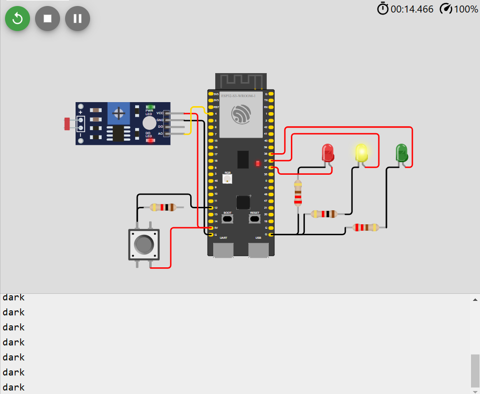
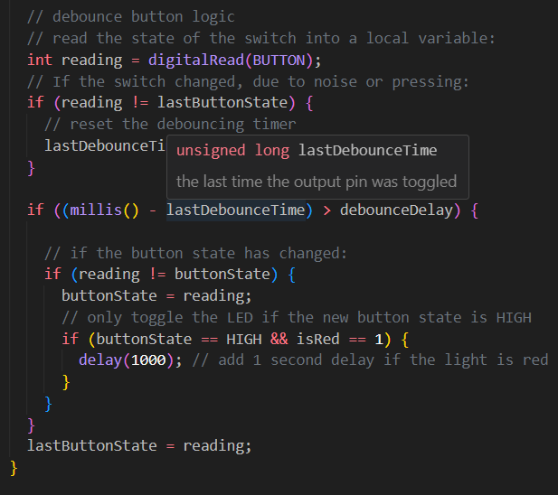
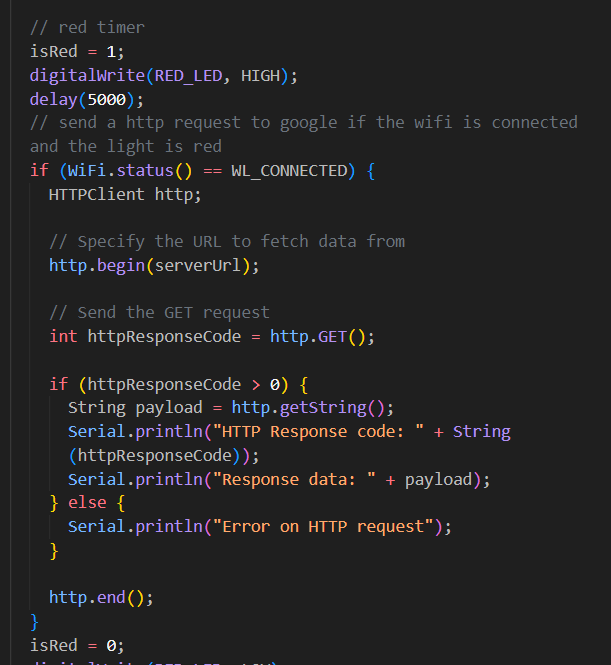

# Cidade clara

    

# Cidade escura

    

# Debounce com millis e adição de 1 segundo quando o farol estiver vermelho e o botão for pressionado.

    

Acima é possível observar o código que implementa o debounce via software e também que verifica se o farol está vermelho para atrasar mais um segundo.

# Requisição HTTP caso a cidade esteja escura e o farol vermelho

    

através do código acima, é possível notar a presença de uma verificação se a esp32 está conectada ao wifi caso o farol esteja vermelho e realiza uma requisição para a url do google.

